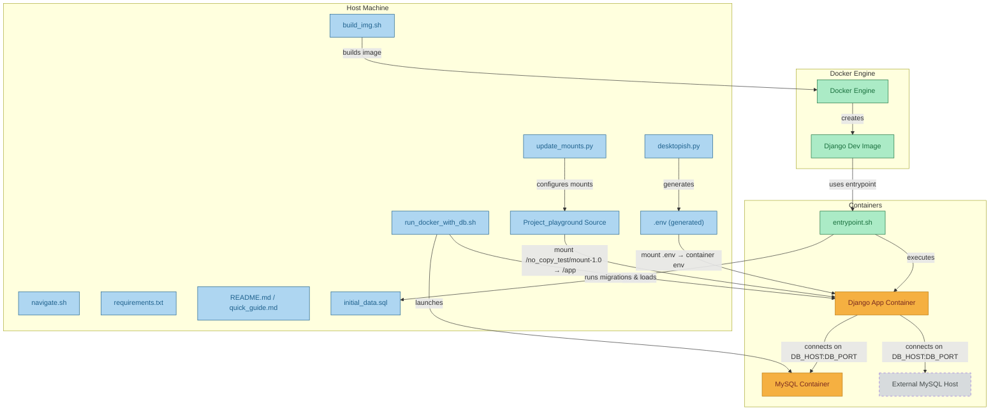

# 🌟 lets_docker — Dockerized Django Playground

A developer-friendly, Docker-powered Django environment with MySQL integration, interactive setup, and ready-to-run scripts. Polished docs with ASCII art, emojis, and Mermaid help you glide from clone → run.

## 🚀 Features

- **Dockerized Django Environment**: Complete Python 3.12 environment with all dependencies
- **MySQL Database Integration**: Automated database setup and connection
- **Project Mounting System**: Dynamic project extraction and mounting
- **Interactive Setup**: CLI-based configuration with secure password handling
- **Database Initialization**: Automated SQL data loading with sample data
- **Development Tools**: Hot-reload, debugging support, and comprehensive logging

## 📋 Prerequisites

Before you begin, ensure you have the following installed:
- Docker and Docker Compose
- Python 3.8+ (for setup scripts)
- Git
- MySQL server (running locally)

Your Django application will be available at: **http://localhost:8000**

## 📁 Project Structure (key area: no_copy_test)

```
no_copy_test/
├── About/Flow/flow_overview.md      # End-to-end flow (ASCII + Mermaid)
├── bash_files/                      # Docker entrypoint and shell scripts
│   ├── build_img.sh                 # Docker image build script
│   ├── run_docker_with_db.sh        # App launcher
│   └── entrypoint.sh                # Container entrypoint
├── creds/desktopish.py              # Interactive env+DB setup
├── datasets_django/initial_data.sql # DB schema and seed data
├── docker-related/                  # Docker configs
│   ├── Dockerfile
│   └── .dockerignore
├── mount-1.0/                       # Django project mount point
│   ├── Project_playground/          # Django project
│   └── update_mounts.py             # Experimental mount utility
├── updated_zip/                     # Packaged project archives
├── quick_guide.md                   # Condensed steps (emoji + ASCII)
└── README.md                        # Master guide (emoji + ASCII + Mermaid)
```

## 🔧 Configuration

### Environment Variables
The setup creates a `.env` file with the following variables:
- `DJANGO_SECRET_KEY`: Django application secret key
- `DB_NAME`: MySQL database name
- `DB_USER`: MySQL username
- `DB_PASSWORD`: MySQL password
- `DB_HOST`: Database host (default: localhost)
- `DB_PORT`: Database port (default: 3306)

### Database Setup
The system includes sample data for:
- **Domain Images**: Technology domain categories with images
- **Problem Statements**: Frontend development challenges and questions

## 🐛 Troubleshooting

### Common Issues

**1. MySQL Connection Errors**
```bash
# Grant permissions for Docker network access
GRANT ALL PRIVILEGES ON *.* TO 'your_user'@'172.17.0.%' IDENTIFIED BY 'your_password';
FLUSH PRIVILEGES;
```

**2. Permission Denied Errors**
```bash
chmod +x ./no_copy_test/bash_files/build_img.sh
chmod +x ./no_copy_test/bash_files/run_docker_with_db.sh
chmod +x ./no_copy_test/bash_files/entrypoint.sh
```

**3. Port Already in Use**
```bash
# Stop existing containers
docker stop $(docker ps -q)
# Or change port in run_docker_with_db.sh
```

**4. Duplicate Database Entries**
The SQL file uses `INSERT IGNORE` to prevent duplicate key errors on re-runs.

## 🔒 Security Notes

- Environment variables are automatically excluded from version control
- Database passwords are handled securely using `getpass`
- The `.env` file is gitignore to prevent credential exposure
- Docker containers run with appropriate user permissions

## 🚀 Development Workflow

1. **Initial Setup**: Run through steps 1-6 once
2. **Daily Development**: Use `./run_docker_with_db.sh` to start
3. **Code Changes**: Files are mounted, so changes reflect immediately
4. **Database Changes**: Update `no_copy_test/datasets_django/initial_data.sql` and restart container
5. **Configuration Changes**: Re-run `python3 desktopish.py`

## 📚 Helpful Links
- no_copy_test/README.md — Master guide with emoji + ASCII + Mermaid
- no_copy_test/quick_guide.md — Super-fast instructions (now with emojis)
- no_copy_test/About/Flow/flow_overview.md — Deep dive with stage-by-stage flow and Mermaid
- Docker Docs: https://docs.docker.com/
- Django Docs: https://docs.djangoproject.com/

## 🤝 Contributing

1. Fork the repository
2. Create a feature branch
3. Make your changes
4. Test thoroughly
5. Submit a pull request


## 🆘 Support

If you encounter issues:
1. Check the troubleshooting section above
2. Review the logs in the Docker container
3. Ensure all prerequisites are installed
4. Verify MySQL is running and accessible

---


**Happy Coding! 🎉**
