# ⚡ Quick Start Guide (no_copy_test)

```
┏━━━━━━━━━━━━━━━━━━━━━━━━━━━━━━━━━━━━━━━━━━━━━━━━━━━━━━━━━━━━━━━━━━━━━━┓
┃  🧭 NAV → 🏗️ Build → 🔐 Secret → 🔧 Configure → 🔁 Mounts → 📦 Zip → ▶️ Run  ┃
┗━━━━━━━━━━━━━━━━━━━━━━━━━━━━━━━━━━━━━━━━━━━━━━━━━━━━━━━━━━━━━━━━━━━━━━┛
```

## 📦 Prerequisites
- git clone https://github.com/zeroisinfinity/lets_docker.git
- Docker installed 🐳, Python 3.8+ 🐍

## 🧭 Navigation System Setup (optional but recommended)
First, set up the navigation system for easier directory access:

```bash
# RUN inside lets_docker/no_copy_test/bash_files
cd bash_files
chmod +x /*.sh   # ⚙️ make executable
./install_nav.sh                       # 🔐 will ask for sudo
```
```bash
# Set your project directory (run in no_copy_test root)
cd ..
source ~/.bashrc
nav set $(pwd)
```
Tip: Use `nav -l` to list bookmarks; try `nav bash_files`, `nav creds`, `nav Project_playground`.

---

## 🚀 Project Setup

### 1) 🏗️ Build the Docker Image
```bash
nav bash_files
./build_img.sh <dev/test-qa/stage/prod>
```

### 2a) 🔐 Generate Django Secret Key (one-time)
```bash
nav Project_playground
python3 manage.py shell
```
Paste in Python shell:
```python
from django.core.management.utils import get_random_secret_key
get_random_secret_key()
```
Then:
```python
quit()
```
Copy the key for the next step.

### 2b) 🔧 Configure Environment
If you are using the CLI setup, you can skip interactive.

- Option 1: Interactive Setup
```bash
nav creds
python3 desktopish.py
```

- Option 2: Non-interactive Setup
```bash
nav creds
python3 desktopish.py --no-input --db-user 'your_user' \
  --db-password 'your_password' --django-secret-key 'your_secret_key'
```

### 3) 🔁 Update Mounts (if needed)
```bash
nav mount-1.0
python3 update_mounts.py
```

### 4) 📦 Package the Project
```bash
nav .
mkdir -p updated_zip
cd mount-1.0 && zip -r "../updated_zip/Project_playground.zip" "Project_playground"
nav .
```

### 5) ▶️ Run the Application
```bash
nav bash_files
./run_docker_with_db.sh
```

---

## 🧭 Navigation Commands Cheatsheet
- `nav set /path/to/project` — Set project directory 📍
- `nav directory_name` — Jump to directory ⚡
- `nav -l` — List available directories 📜
- `nav` — Go to project root 🏠

## 🗺️ Mermaid: Quick Flow

```mermaid
flowchart LR
  A[Clone 📦] --> B[Build 🏗️]
  B --> C[Secret 🔐]
  C --> D[Configure 🔧]
  D --> E[Mounts 🔁]
  E --> F[Zip 📦]
  F --> G[Run ▶️]
```
